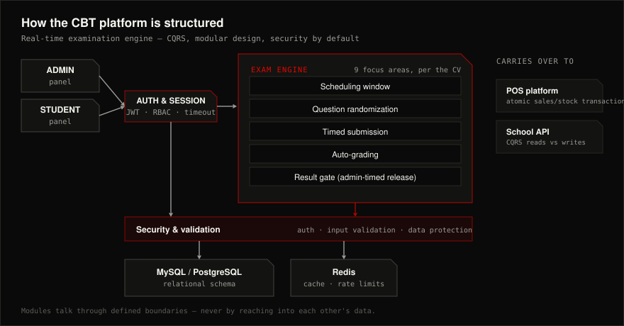

  

&nbsp;&nbsp;

 

## About

I build backend infrastructure and the interfaces on top of it — database structures, REST APIs, authentication, background processing, caching, and transactional workflows — with an emphasis on clean architecture, CQRS, and domain-driven design. The goal is systems that stay dependable as complexity and traffic grow, not ones that only work on day one.

<table>
<tr><td width="150" valign="top"><b>Now</b></td><td>Freelance / personal development since 2023, most recently a real-time CBT examination platform</td></tr>
<tr><td width="150" valign="top"><b>Stack</b></td><td>PHP · Laravel · Node.js · Express · TypeScript · Fastify · React</td></tr>
<tr><td width="150" valign="top"><b>Architecture</b></td><td>CQRS · MVC · modular monolith · microservices · dependency injection</td></tr>
<tr><td width="150" valign="top"><b>Studying</b></td><td>Certified in Software Engineering and Data Analysis, Newdich Technology, 2024–2026</td></tr>
<tr><td width="150" valign="top"><b>Ask me about</b></td><td>Time-boxed exam scheduling, Redis-backed rate limiting, atomic transactions across sales/stock/COGS, role-based access control</td></tr>
</table>

 

## Stack

 

## Building

**Real-Time CBT SaaS Examination Platform** — 2023–present · PHP · Laravel · CQRS · Redis · MySQL
Secure, centralized administration of online examinations, architected around CQRS, OOP, and modular design for clean separation of responsibilities and easy feature expansion.
- Centralized admin controls for users, exams, subjects, question banks, schedules, access permissions, and result publication
- Time-based exam scheduling — candidates can only access an exam within its configured window
- Real-time timed assessments with question randomization, answer submission, automatic grading, and result processing
- Controlled result publication, so admins decide exactly when results go live
- Security hardened across authentication, authorization, session management, input validation, and access control
- Transactional workflows keeping candidate answers, submissions, scores, and results consistent
- Structured for low coupling, so new modules integrate without disturbing existing ones

**Scalable POS SaaS Platform & Inventory Management System** · PHP · CQRS · Redis · Transactions
A point-of-sale platform covering sales, products, inventory, purchases, users, expenses, and financial transactions.
- PHP OOP backend with CQRS and modular design for a maintainable foundation
- Redis for caching and rate limiting — fewer redundant DB hits, controlled request load
- Session idle-timeout handling for inactive sessions, and optimized data-access workflows to cut repeated queries
- Atomic transactions across sales, sale items, inventory, stock movements, COGS, and financial records
- Inventory management: stock levels, purchases, movements, low-stock monitoring
- Role-based access control for admins, managers, cashiers, and inventory staff

**School Management System** · Node.js · Express · REST · CQRS
A scalable school management API built on Node.js and Express.
- RESTful APIs for students, classes, results, and administrative operations
- CQRS separating read and write paths for scalability and maintainability
- Relational database design, plus authentication, authorization, and full CRUD functionality

 

## How I structure a backend

The shape the CBT platform takes — the pattern that carries over into the POS system and school API too.

 

## Principles

<table>
<tr><td width="200" valign="top"><b>Boundaries before frameworks</b></td><td>Modules talk by command and event, never by reaching into each other's data — CQRS is the boundary, not decoration.</td></tr>
<tr><td width="200" valign="top"><b>Security is a default</b></td><td>Authentication, authorization, session timeouts, and input validation are built in from the first commit, not bolted on later.</td></tr>
<tr><td width="200" valign="top"><b>Consistency over speed</b></td><td>Transactional workflows keep sales, stock, scores, and results consistent even when something fails halfway.</td></tr>
<tr><td width="200" valign="top"><b>Cache what's expensive, not everything</b></td><td>Redis for rate limits and repeated reads, not as a substitute for a correct query.</td></tr>
</table>

 

## Connect

&nbsp;

  
<a href="https://github.com/shola129">github.com/shola129</a> · Lagos, Nigeria

